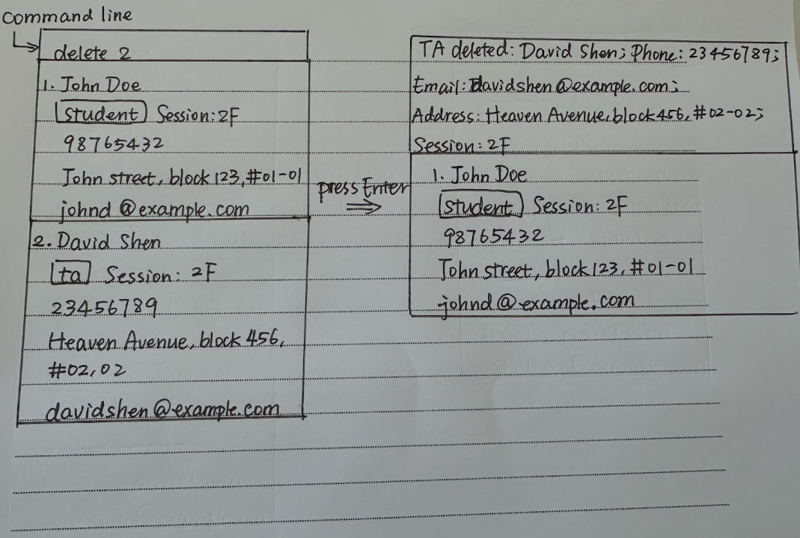

# TAConnect

TAConnect is designed for Teaching Assistants (TAs) at NUS teaching CS modules, 
who want to deal with the contact of students in their sessions, fellow TAs, course instructors, and faculty staff.

It proposes an efficient way for TAs to access contact details, 
making it more convenient to support students, coordinate with other TAs and reach out to staff in case of unexpected situations.

For the detailed documentation of this project, see the *[Product Website](https://ay2526s1-cs2103t-f15a-1.github.io/tp/)*.

This project is based on the AddressBook-Level3 project created by the [SE-EDU initiative](https://se-education.org).

# Features
- Add contacts (students, TAs, instructors or staff) with detailed information.
- Delete a contact by index.
- Find contacts by keyword (substring, case-insensitive).
- List all contacts.
- List all students in a specific session.

## Resources
- [Original AddressBook Product Website](https://se-education.org/addressbook-level3)
- [se-education.org contribution guide](https://se-education.org/#contributing-to-se-edu)
